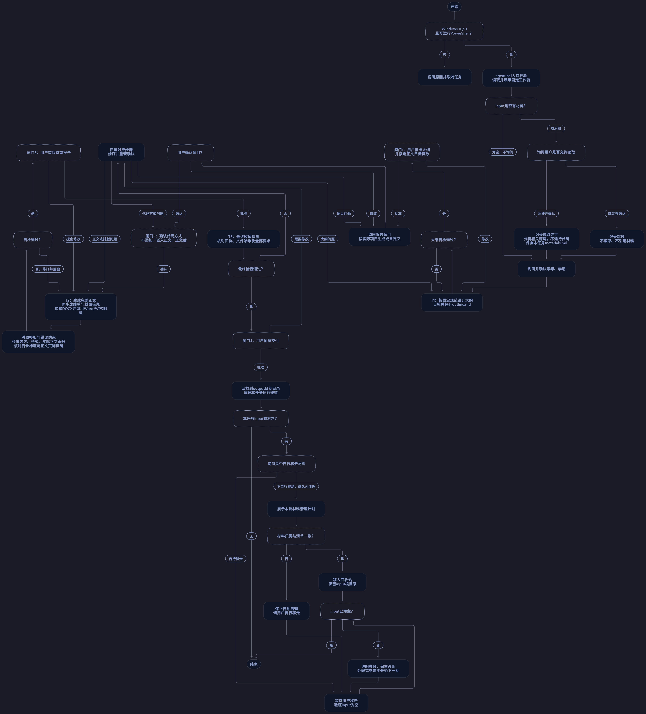

# QBWordAgent —— 面向青岛滨海学院信息工程学院学科期末大报告智能体

    

---
    

**QBWordAgent**是一款**面向Windows 10/11**本地运行Agent（智能体），基于Windows系统内置PowerShell 壳程序脚本开发制作 **运行入口为agent.ps1**。

本项目生成文件支持的预览器有：Microsoft Office、WPS、Adobe PDF

**已通过检验通用大模型智能体包括：豆包桌面端、TraeCodeCN、Codex、DeepSeek Harness、WorkBuddy、Cursor**

**注**：该智能体理论上支持MacOS系统的使用，但不适配HarmonyOS系统，因HarmonyOS底层默认不适配PowerShell的运行环境，若想体验则需在HarmonyOS系统内下载对应的转接口，将.ps1文件转换为.sh（Shell脚本）文件，再移交系统进行处理

## 工作原理

该智能体的实现原理分为两步

**第一步**：AI（MLLM）负责去理解文本和工作

**第二布**：固定.ps1脚本会负责执行与校验，确保模型能在智能体的规范约束下工作

* **AI大模型**会读取固定工作流（WorkFlow），经授权分析材料，设计大纲并撰写正文
* **PowerShell脚本**按统一模板构建文档，调用Microsoft Word 或 WPS完成实际排版
* **智能体校验器**检查格式、正文页数、目录与页脚页码；不合格就退回修改
* **智能体状态机**保存任务进度，通过四道用户确认后才发布，最后归档并处理残留材料
  
  

## 符合学院要求的合格的版式与验收

- 正文一级标题使用中文序号

- 目录一级标题为1.、2.；二级标题为1.1等

- 目录逐项绑定书签和PAGEREF，核对排版引擎实际页码及保存后的域结果

- 正文从目录后下一页开始，页脚从1开始

- 默认无附录，字数不限，以用户确认的正文页数为准

**不通过页数、目录或完整性检查时不得进入闸门3或发布**

## 智能体使用教程 qwq

1. 将该项目文件夹作为你PC端已有通用智能体的 **WorkSpace（或工作区）** 读取完工作区后将成功载入该智能体

2. 若无文件请跳过第二条。若有文件需上传进行录入，**请将文件以zip或7z压缩包形式放至目录下input文件夹中**，项目放入到该文件夹中，Agent自动会进行读取和识别

3. 上传完毕后点开PC端已有通用智能体，开启对话，按照如下实例进行对话：”**请帮我生成一份XXX知识相关的期末大报告**“，若有文件上传，则添加语句”请读取input目录已上传文件“来贴合本智能体关键词

4. AI会返回一个完整的**工作流WorkFlow**，请检查工作流内容是否符合个人的需求，若有问题请即使进行调整（正常来说是不会有问题滴 0W0 ）

5. **依据AI的询问回答学年或学期**，填写实例如：2025-2026、2026-2027、2027-2028等

6. **闸门一** AI会生成预览大纲outline.md，用户会在智能体中查看大纲的情况，并确定批准是否开启闸门，**回答是或否**即可

7. **闸门二** AI会询问用户是否要在报告中添加代码块，添加的方式有：**不添加、嵌入正文、正文后** 三种选择方式，用户可以根据AI的回答自行选择这三种之一，若有别的更多需求可详细填写。

8. **闸门三** AI会生成一份大概的报告，用户需要确定是否合格，若合格则 **回答“是”**，智能体会开放闸门开启下一步的任务操作，若 **回答“否”**，可根据个人的需求继续调整，智能体会开启逻辑循环，直到用户同意放行闸门结束

9. **闸门四** AI会不断地审查项目中是否有各种问题：如字号大小是否合适、行间距、页脚和目录是否完整等，用户可通过自己审查确定报告是否还有细节问题，若无问题则 **回答“是”** 开放闸门四，**在闸门四开放后生成的报告会放置在output目录中，按照日期的文件夹来分类**

10. 项目生成完毕后AI会询问是否清理本地缓存资源，请选择是来删除本地的生成附加文件，释放磁盘资源

## ### 项目工作流程图 awa

项目完整工作流程图如下图所示：

## 项目内各目录详解

- **input**：放置用于本批项目的材料入口；放入新一批数据前须清空本目录，有内容先询问读取权限，报告发布后询问移走或授权清理

- **src/native**：固定的原生状态机、内容校验、Open XML构建、Office运行时和维护命令

- **scripts/refresh_word_fields.ps1**：Word/WPS共享的兼容接口分页及目录页码校验

- **workflow**：固定工作流及命令参数

- **agents、config**：提示词、约束及完整性清单

- **dir/YYYYMMDD[_NN]**：大纲、内容、状态、待审稿

- **output/YYYYMMDD[_NN]**：闸门4批准后的最终报告

- **samples**：学校模板、参考内容和错误样本，均保留

- **tmp/staging**：未发布文档及诊断

- **dist**：便携包

## 当前边界

Windows原生迁移需要真实Office验收；存在自动化注册不等于可用。WPS接口因版本而异，实机探测未通过不得宣称兼容。具体环境状态见本次维护交付说明
学校模板目前支持单节三页DOCX；多节模板会明确的拒绝，源文件不修改。**原生输出文件格式为docx，旧版本的doc导出及显式附录目前暂不支持**。

该智能体不会修改用户本地电脑的系统注册表环境、永久系统环境变量或Office安装等，请放心食用！详见PORTABLE.md

**大纲唯一设计规范**：templates/OUTLINE_RULES.md

**配套固定骨架**：templates/outline.md

成绩单和封面统一使用本任务确认的题目、学年与学期；保存后重新核对。分发包名称及解压目录使用QBWordAgent，项目当前路径保持可用。

## 用户材料

Java、Python、C、C\#、Go、HTML或其他项目可以放到input。**AI未经同意不会读取目录内内容**，用户放行允许后会按相关源码进行分批分析；该智能体不会自动执行项目、安装依赖或运行其脚本。任务中请勿修改/移动材料。发布后自行移走，或明确选择由AI按预览计划移入回收站；未回答不会删除。input根目录保留，每次加入新批次前必须为空

## 开源协议

本项目采用 [MIT License](./LICENSE) 开源协议。允许flok以及二次开发
